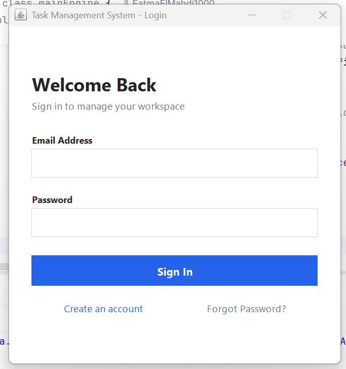
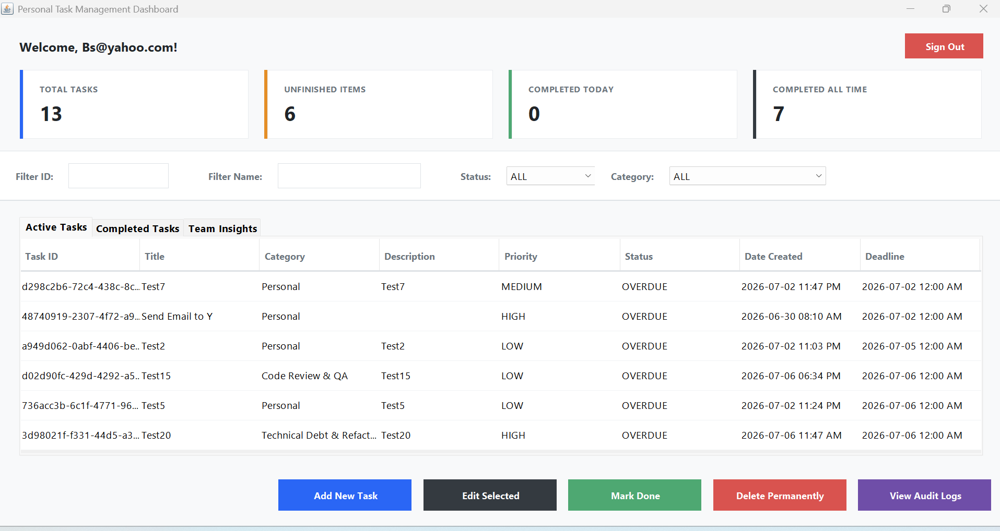
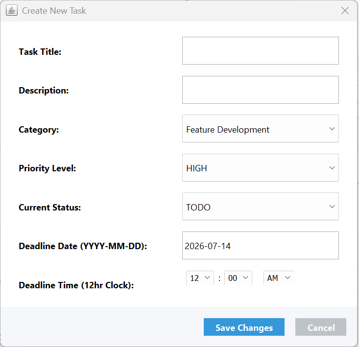
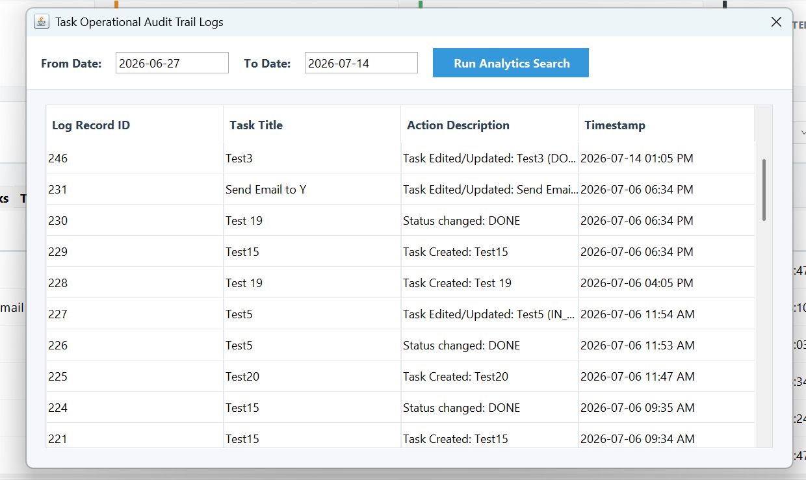

# 📋 Multi-User Task Management System (Desktop Application)

A desktop-based Task Management System developed using ***Java Swing, Oracle Database, and JDBC.***

While the application provides a clean and functional desktop interface, the primary objective of this project was ***software architecture*** and ***system design*** rather than UI design. The project focuses on applying Object-Oriented Programming, Layered Architecture ***(UI → Service → DAO → Database)***, the DAO design pattern, JDBC, and relational database design to build a maintainable and scalable desktop application.

The system allows multiple users to securely manage their personal tasks through authentication, task management, activity logging, deadline notifications, and advanced filtering while demonstrating real-world software engineering principles.

---

## 🎥 Project Demo

> 📹 **Demo Video**

>  https://drive.google.com/open?id=1PHgMEdt77zYHWce2OUJ5QpCI69r3lgTP&usp=drive_fs

---

## 📊 Project Presentation

> 📄 **PowerPoint Presentation**
 

> https://docs.google.com/presentation/d/1EJmxYl9ya2V3nMwTVWwTVcBS0_3D9Wqo?rtpof=true&usp=drive_fs

## 💻 Download & Run

> 📦 **Executable Version**

Download the latest release here:

**➡️ https://github.com/FatmaElMahdi1000/Multi-User_Task_Management_System_DeskTop_App/tree/master/Releases

---

# 🚀 Features

### 👤 User Management

- User Registration
- Secure Login
- Multi-user Support
- User-specific Tasks

### ✅ Task Management

- Create Tasks
- Edit Tasks
- Delete Tasks
- Mark Tasks as Completed
- Assign Priorities
- Categories
- Deadlines

### 📈 Dashboard

- Active Tasks
- Completed Tasks
- Task Statistics
- Search by Task ID
- Search by Title
- Filter by Status

### 🔔 Notifications

- One-hour Deadline Reminder
- Deadline Reached Alert
- Automatic Dashboard Refresh

### 📑 Activity Logs

- Complete Audit Trail
- Date Range Filtering

---

# 🛠️ Technologies

- Java
- Java Swing
- Oracle Database
- JDBC
- SQL
- IntelliJ IDEA

---

# 🏗️ Project Architecture

```
                 User
                   │
                   ▼
            Java Swing UI
                   │
                   ▼
      AuthenticationService
            TaskService
                   │
                   ▼
       UserProfileDAO
            TaskDAO
                   │
                   ▼
      JDBC PreparedStatement
                   │
                   ▼
          Oracle Database
```

---

# 📁 Project Structure

```
src
│
├── Main
├── Model
├── DAO
├── Service
└── UI
```

## 📦 Packages

### Model

Represents the application's business entities.

- UserProfile
- Task

---

### DAO

Handles all database operations.

- UserProfileDAO
- TaskDAO

Responsibilities:

- INSERT
- UPDATE
- DELETE
- SELECT

---

### Service

Contains business logic.

- AuthenticationService
- TaskService
- UserProfileCreationService
- DeadlinePeepingService

---

### UI

Java Swing graphical interface.

- LoginFrame
- RegisterDialog
- MainApplication
- AddTaskDialog
- ActivityLogWindow

---

# 🗄️ Database Design

## USER_PROFILES

| Column | Description |
|---------|-------------|
| USER_ID | Primary Key |
| USER_NAME | User Name |
| EMAIL | Email Address |
| PASSWORD | Password |

## TASKS

| Column | Description |
|---------|-------------|
| TASK_ID | Primary Key |
| USER_ID | Foreign Key |
| CATEGORY_ID | Category |
| TITLE | Task Title |
| DESCRIPTION | Description |
| PRIORITY | Priority |
| STATUS | Status |
| DEADLINE | Deadline |
| CREATED_AT | Creation Date |

Relationship:

```
USER_PROFILES
      │
      │ 1
      │
      ▼
     TASKS
```

One user can own multiple tasks.

---

# 🔄 Application Flow

```
User

↓

Create Task

↓

ActionListener

↓

Task Object

↓

TaskService

↓

TaskDAO

↓

PreparedStatement

↓

Oracle Database

↓

Task Saved

↓

Refresh JTable
```

---

# 🔐 Authentication Flow

```
User

↓

Login

↓

AuthenticationService

↓

UserProfileDAO

↓

LEFT JOIN

↓

Oracle Database

↓

UserProfile

↓

MainApplication
```

---

# 💡 Object-Oriented Design

The project demonstrates:

- Association
- Aggregation
- Bidirectional Association
- DAO Design Pattern
- Layered Architecture

---

# 📸 Screenshots

## Login Screen
>  


---

## Dashboard

>  


---

## Create Task

> 


---

## Activity Logs

> 


---

# 📚 What I Learned

During this project, I strengthened my understanding of:

- Java Object-Oriented Programming
- Java Swing GUI Development
- JDBC
- Oracle Database
- SQL
- DAO Pattern
- Layered Architecture
- Event-Driven Programming
- Relational Database Design

---

# 🚀 Future Improvements

- Password Hashing
- Spring Boot Backend
- REST API
- Role-Based Access Control
- Export to PDF
- Export to Excel
- Charts & Analytics
- Unit Testing
- Cloud Database
- Responsive UI

---

# ⚙️ Getting Started

## Clone the Repository

```bash
git clone https://github.com/FatmaElMahdi1000/Multi-User_Task_Management_System_DeskTop_App.git
```

---

## Requirements

- Java JDK 17+ (or your project version)
- Oracle Database
- IntelliJ IDEA (recommended)

---

## Run

1. Clone the repository.
2. Configure the Oracle database connection.
3. Execute the SQL scripts.
4. Open the project in IntelliJ IDEA.
5. Run `mainEngine.java`.

---

# 👩‍💻 Author

**Fatma ElMahdi**

- GitHub: https://github.com/FatmaElMahdi1000
- LinkedIn: https://www.linkedin.com/in/fatma-el-mahdi-837a80177/

---

# ⭐ Support

If you found this project helpful, consider giving it a ⭐ on GitHub!

---
 
